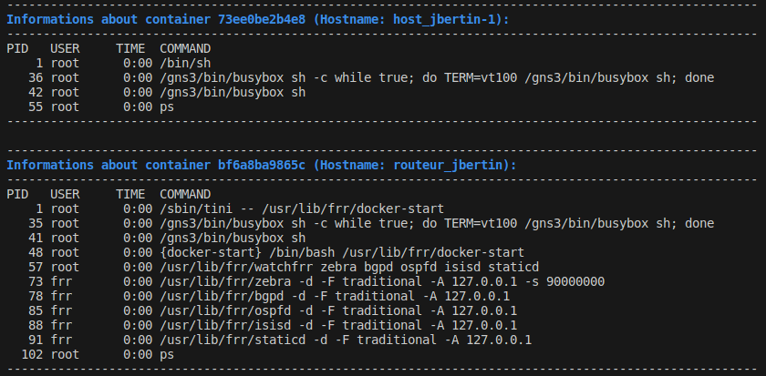

## P1

----

### Usage

#### 1. First launch : Build required Docker containers
``./build_dockers.sh``

#### 2. Launch p1 configuration
``p1.gns3project``

#### 3. Start all nodes with ``Control`` / ``Start/Resume all nodes`` inside GNS3.

#### 4. Test mandatory configuration :
``./mandatory_tests.sh``

NB : You can open a shell inside a node by **right click / Auxiliary Console**.

----

### FRRouting (FRR) Daemons

FRRouting (FRR) is a network routing software suite that provides protocol daemons for BGP, OSPF, RIP, IS-IS, LDP, PIM, and more. It is an IP routing protocol suite for Unix and Linux platforms. Below, we delve into the specific daemons integral to FRRouting:

#### Zebra

- **Daemon**: `zebra`
- **Description**: This is the central daemon for FRRouting (FRR). It manages the kernel's routing tables and redistributes routes between different routing protocols. It is responsible for managing the IP routing tables.
- **Usage**: It is utilized to maintain the Linux kernel's routing table, adding, updating, and removing routes based on information received from other routing daemons.

#### BGPd

- **Daemon**: `bgpd`
- **Description**: This daemon implements the Border Gateway Protocol (BGP). BGP is extensively used on the internet to exchange routing information between different autonomous systems (AS).
- **Usage**: It is employed to exchange routing information with other BGP routers, both within and outside your network, thereby facilitating inter-domain routing.

#### OSPFd

- **Daemon**: `ospfd`
- **Description**: This daemon implements the Open Shortest Path First (OSPF) protocol, which is a link-state based internal routing protocol (IGP).
- **Usage**: It is used to discover and maintain the shortest routes within a network, utilizing Dijkstra's algorithm to calculate the shortest path.

#### ISISd

- **Daemon**: `isisd`
- **Description**: This daemon implements the Intermediate System to Intermediate System (IS-IS) protocol, another link-state based IGP, often used in large networks such as service provider networks.
- **Usage**: It is used to exchange routing information with other IS-IS routers, allowing for dynamic route discovery and rapid convergence in the event of topology changes.

#### Staticd

- **Daemon**: `staticd`
- **Description**: This daemon is responsible for managing static routes in FRR. Static routes are routes that are manually defined by the network administrator, rather than being dynamically learned through routing protocols.
- **Usage**: It is used to configure and manage static routes, which are manually defined routes to direct traffic along a path specified by the network administrator.

**Each of these daemons plays a crucial role in the functioning of our network, enabling dynamic routing and the management of routing tables to ensure efficient and reliable network operation.**
