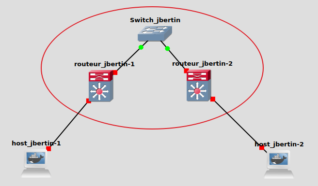
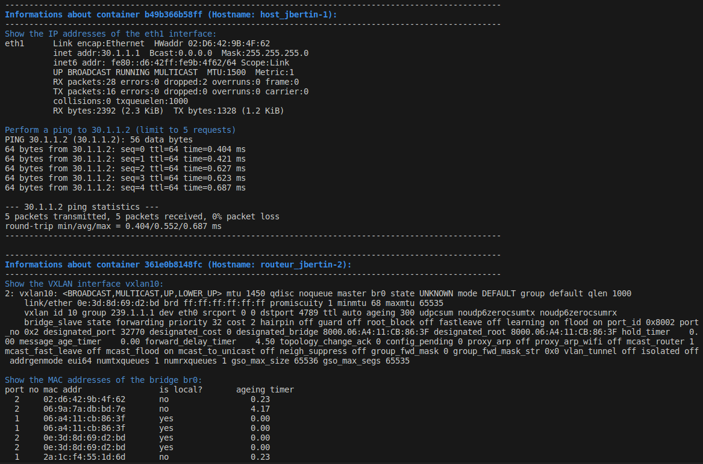

## P2

----

### Usage

#### 1. Launch p2 configuration
``p2.gns3project``

#### 2. Start all nodes with ``Control`` / ``Start/Resume all nodes`` inside GNS3.

#### 3. launch ``config.sh`` script to setup the network
``./config.sh``

#### 4. Test mandatory configuration :
``./mandatory_tests.sh``

*This is only part of the tests carried out.*

----

### Specific configuration in GNS3

For : host_jbertin-1, host_jbertin-2, routeur_jbertin-1, routeur_jbertin-2
- right click / configure
- Adapters : 2

Add links :
- Switch_jbertin eth0 -> routeur-jbertin-1 eth0
- Switch_jbertin eth0 -> routeur-jbertin-2 eth0
- routeur-jbertin-1 eth1 -> host_jbertin-1 eth1
- routeur-jbertin-2 eth1 -> host_jbertin-2 eth1

----

### Definitions:

#### VXLAN (RFC 7348)
VXLAN, which stands for Virtual Extensible LAN, is defined in the RFC 7348 standard. It is a network virtualization technology that attempts to address the scalability problems associated with large cloud computing deployments. VXLAN extends a Layer 2 segment (LAN) over a Layer 3 (IP) network, allowing for more LAN segments than traditional VLANs. It encapsulates MAC frames in UDP datagrams to traverse the Layer 3 network, thereby providing a higher scale of logical networks and improving isolation between tenant networks.

#### Bridge
In the context of networking, a bridge is a hardware or software component that connects and filters traffic between two or more network segments, making them function as a single network. It operates at the data link layer (Layer 2) of the OSI model. By using a bridging table to keep track of MAC addresses and the associated network segments, it can determine if a data packet should be forwarded or filtered, effectively controlling traffic flow and reducing network collisions, thereby organizing the network more efficiently.

#### Dynamic Multicast
Dynamic multicast refers to a method where multicast traffic is dynamically distributed across a network. It involves protocols and technologies that automatically construct and manage multicast group memberships and multicast distribution trees. Dynamic multicast solutions can adapt to changes in the network topology and group membership, ensuring efficient delivery of multicast traffic by dynamically adjusting the paths that multicast traffic takes through the network. It contrasts with static multicast configurations, where paths and group memberships are manually configured and do not adapt to changes in the network. Dynamic multicast technologies include protocols such as PIM (Protocol Independent Multicast) and IGMP (Internet Group Management Protocol) which help in dynamically managing multicast traffic in a network.
