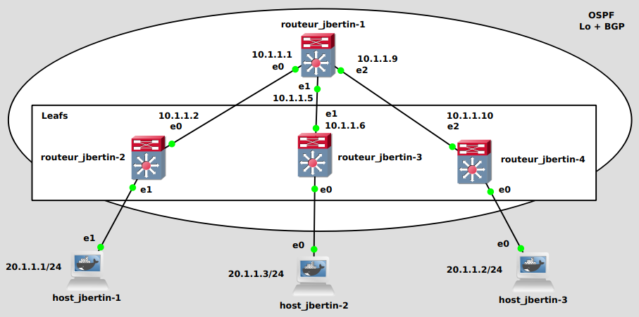
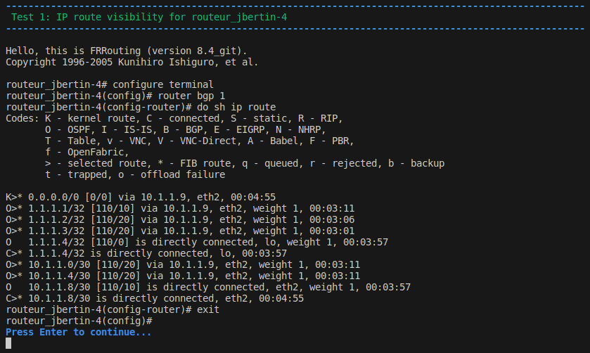
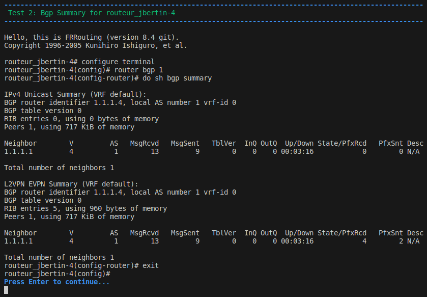

# P3



----

### Usage

#### 1. Open p3 configuration inside GNS3
``p3.gns3project``

#### 2. Start all nodes with ``Control`` / ``Start/Resume all nodes`` inside GNS3.

#### 3. Launch ``config.sh`` script to setup the network
``./config.sh``

#### 4. Wait a moment, once the configuration script is finished, the configuration will take a few seconds to set up

#### 5. Test mandatory configuration :
``./mandatory_tests.sh``





*This is only part of the tests carried out.*

----

### Specific configuration in GNS3

For : host_jbertin-1, host_jbertin-2, routeur_jbertin-1, routeur_jbertin-2
- right click / configure
- Adapters : 3

Add links :
- routeur-jbertin-1 eth0 -> routeur-jbertin-2 eth0
- routeur-jbertin-1 eth1 -> routeur-jbertin-3 eth1
- routeur-jbertin-1 eth2 -> routeur-jbertin-4 eth2
- routeur-jbertin-1 eth1 -> host_jbertin-1 eth1
- routeur-jbertin-2 eth0 -> host_jbertin-2 eth0
- routeur-jbertin-3 eth0 -> host_jbertin-3 eth0

----

### The shell to use in GNS3 to config and verify
Enter the specific shell
```
	vtysh
```
and then config using
```
	config t
```

### Some definitions

#### VXLAN
The **Virtual Extensible LAN** (**VXLAN**) is a network virtualization technology that is commonly used in data center environments and cloud computing. It allows network administrators to create large-scale, logical, and isolated network segments or virtual networks on top of an existing physical network infrastructure. VXLAN is part of the software-defined networking and network virtualization trends. It is designed to address the limitations of traditional VLAN.

#### BGP
The **Border Gateway Protocol** (**BGP**) is a scalable dynamic routing protocol that is used by groups of routers on the Internet to share routing information.
BGP comes in two flavors: internal BGP (iBGP) and external BGP (eBGP).
 - Internal BGP (**iBGP**) connects routers within an Autonomous Systems (AS).
 - External BGP (**eBGP**) connects routers in different AS.

Some links:
 - https://networklessons.com/bgp/bgp-route-reflector

#### Route Reflector
Inside an autonomous system, a route received from an iBGP neighbor is not forwarded to other iBGP neighbors.
So that the routes are known by all the routers of the AS, they therefore establish connections between them in a complete mesh, which poses a problem of scale when these routers are numerous, the number of connections increasing as the square of the number of routers.

The **Route Reflector** (**RR**) makes it possible to reduce this constraint: it redistributes the routes learned by iBGP to iBGP peers.
These only need to establish iBGP sessions with the RR.

#### eVPN
The **Ethernet VPN** (**eVPN**) is a technology for carrying Ethernet traffic like a virtual private network using wide area network protocols.
EVPN embeds Ethernet over MPLS and Ethernet over VXLAN1 or 2.

#### OSPF
The **Open Shortest Path First** (**OSPF**) technology is a protocol used to determine the best path for packets to travel through a series of connected networks.

Some links:
 - https://fr.wikipedia.org/wiki/Open_Shortest_Path_First
 - https://www.cisco.com/c/fr_ca/support/docs/ip/open-shortest-path-first-ospf/7039-1.html

#### VNI
The **Virtual Network Identifier** (**VNI**) are used to identify and segregate different virtual networks or segments within a physical network infrastructure. They are commonly used with VXLAN.


